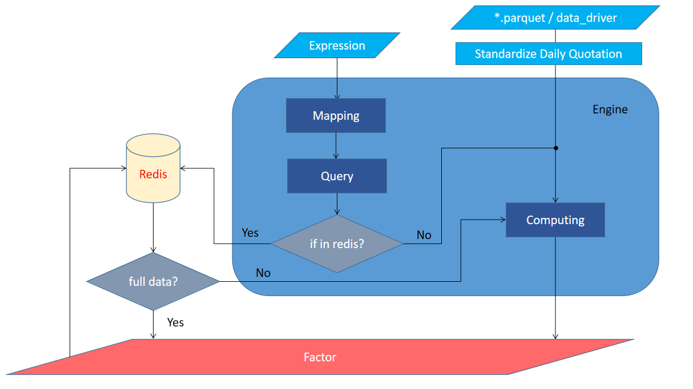

# Platform

### 1. data/
As its name means, this directory is used for data managing. `collector.py` is responsible for daily quotation reading, writing and standardizing. `database.py` is the interface of `Redis`, we may add more features in the future.

### 2. docs/
This directory contains project documents and resources.

### 3. test/
This directory is used to debug while coding.

### 4. utils/
Generally, in factor computing, we need to implement some meta computing process to reduce the duplication of computing. So we add meta function in `mapping.py` and it supports extensions. We could provide computing task in two ways. One is inputting en expression from keyboard, another is that submitting a config, including *expression* and *name*. And the second way is what `task.py` did.

### 5. workflow/
`engine.py` is more likely a consumer, which computes the tasks sent from *celery* by parsing the given expression. `cmd_manager.py` is the startup program for *celery*. Then, we could input expression by executing `cmd_main.py`.

# Architecture
The flow chart of this platform is shown in the figure below

As we can see, we just need to input expression and daily quotation, then we could get the factors automatically. In this platform, expression would be resolved to a combination of metafunctions. The functions will make a request for data or factors to *Redis*, and then compute the full factor or only the incremental part according to the request result. Factors can be exported when the calculation is complete.